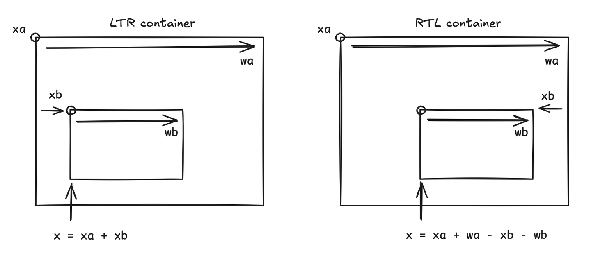

# Right-to-left (RTL) support

Applications may need to be localised for regions where the language is written
from right to left, such as Hebrew or Arabic. Users expect not only the text to
be correctly rendered, but also the whole layout to be mirrored: rails populate
from right to left, a side navigation on the left appears on the right instead,
and so on.

By contrast, the default layout and text direction is called "left-to-right"
(LTR).

RTL support has two independent aspects:

- **RTL layout** — mirroring the structure of the scene graph, and
- **RTL text** — correctly ordering bidirectional (mixed LTR/RTL) text.

They can be used separately. Layout mirroring works with any text; bidirectional
text rendering is currently a **Canvas-only** feature (see the
[limitations](#limitations) below).

## RTL layout

Every node has an `rtl` property that hints whether the node's **children**
should be laid out mirrored:

```ts
const container = renderer.createNode({
  x: 20,
  y: 20,
  w: 700, // a width is required — see the caveat below
  h: 200,
  rtl: true,
  parent: root,
});

// Children use the same `x` you'd use for LTR; it is interpreted from the
// right edge automatically.
renderer.createNode({ x: 0, w: 200, h: 200, parent: container }); // rightmost
renderer.createNode({ x: 220, w: 200, h: 200, parent: container }); // middle
renderer.createNode({ x: 440, w: 200, h: 200, parent: container }); // leftmost
```

The `rtl` flag is **inherited**: setting it on a node mirrors that node's whole
sub-tree. In practice, setting `rtl` on the application root mirrors the entire
app:

```ts
renderer.root.rtl = true;
```

To opt a sub-tree back out of mirroring, set an explicit `rtl: false` on it:

```ts
// Inside an RTL app, this branch lays its children out left-to-right again.
renderer.createNode({ rtl: false, parent: someRtlBranch });
```

`rtl` accepts three values:

| Value   | Meaning                               |
| ------- | ------------------------------------- |
| `true`  | Mirror this node's children           |
| `false` | Force left-to-right for this sub-tree |
| `null`  | Inherit from the parent (the default) |

A node's own position is governed by its **parent's** resolved direction, while
its own `rtl` value governs how **its children** are placed. So `rtl: false` on
a leaf node has no visible effect — it only matters for nodes that have children.

### How the mirroring is calculated

When a parent is RTL, a child's horizontal position is measured from the
parent's right edge instead of its left:



- **LTR:** `x = xa + xb`
- **RTL:** `x = xa + wa - xb - wb`

where `wa` is the parent width, `wb` the child width, and `xb` the child's `x`.
Scale is taken into account (`wb` is the scaled width).

> **Important caveat:** because the calculation needs `wa`, **the parent must
> have a known width** (`w`). In an LTR-only app it is often possible to omit
> `w` on containers, but for automatic RTL mirroring to work, the width must be
> set. A parent without a width lays its children out left-to-right.

### Text alignment

The `rtl` flag also mirrors text alignment: a text node's `textAlign` of `left`
and `right` are automatically reversed when the node resolves to RTL. So
`textAlign: 'left'` (the default) becomes right-aligned, which is what you want
for RTL UIs. `center` is unchanged.

Note that flipping the alignment alone does **not** reorder the characters of
mixed LTR/RTL text — see [RTL text](#rtl-text) below for that.

## RTL text

Correctly rendering RTL text requires _bidirectional_ (bidi) layout: a single
string may combine LTR and RTL runs — numbers and untranslated words stay
left-to-right, while Hebrew/Arabic runs go right-to-left.

On the **Canvas** text renderer this works automatically by leaning on the
browser's built-in text engine. Force the canvas renderer and mark the node (or
an ancestor) as `rtl`:

```ts
renderer.createTextNode({
  w: 560,
  rtl: true, // or inherit from an rtl ancestor
  textRendererOverride: 'canvas',
  fontFamily: 'NotoSansHebrew', // a font that actually covers the script
  fontSize: 40,
  text: 'שלום world 123',
  parent: root,
});
```

With `rtl` set, the line is given an RTL base direction and the browser reorders
the runs: `שלום world 123` renders as `world 123 שלום`, `90 דקות` renders as
`דקות 90`, each right-aligned within the node.

The text renderer detects direction from the node's resolved `rtl` flag; there
is no separate tokenizer to configure and no extra dependency to install.

> **Use a font that covers the script.** The Canvas renderer draws with the font
> you load via `stage.loadFont('canvas', …)`. If that font lacks Hebrew (or
> Arabic) glyphs, the browser falls back to a system font, which varies between
> machines. Load a script-covering font (e.g. Noto Sans Hebrew) and reference it
> by `fontFamily` so rendering is consistent everywhere.

### Bidirectional concatenation

When a label is built by concatenating several parts — `{title} {description}`
or `{tag1} {tag2} {tag3}` — the parts can interact: a leading LTR part can flip
how the whole reads, and an LTR number in one part can attach to a neighbouring
part. To keep each part self-contained, wrap it in Unicode _isolate_ characters:

```ts
const FSI = '\u2068'; // First Strong Isolate (auto-detect each part)
const PDI = '\u2069'; // Pop Directional Isolate

const label = parts.map((p) => `${FSI}${p}${PDI}`).join(' ');
```

This is plain Unicode handled by the browser's bidi engine — no API is required.

## Input

This renderer does not handle remote/keyboard input. If your application mirrors
its layout, remember that the _visual_ meaning of Left and Right is reversed, so
your input layer should swap Left/Right key handling for mirrored sub-trees. That
logic lives in the application, not the renderer.

## Limitations

- **SDF text is not yet bidi-aware.** Signed-distance-field text renders glyphs
  in logical order, so mixed/RTL strings will look incorrect. Use
  `textRendererOverride: 'canvas'` for RTL text for now.
- **Arabic shaping** (contextual letter joining) is out of scope. Hebrew and
  other non-joining scripts, plus mixed LTR, are supported on Canvas.
- **`letterSpacing` is ignored for RTL text.** Per-character spacing is drawn
  glyph-by-glyph, which defeats bidi reordering, so it is forced to `0` for RTL
  nodes.
- **Layout mirroring requires known widths** (see the caveat above).

## Browser support

RTL text relies on the browser's built-in `fillText` bidi, which is available on
all supported targets. The base direction is forced using Unicode control
characters (RLE/PDF) rather than the `CanvasRenderingContext2D.direction`
property, so it works down to the engine's Chrome 38 floor.
